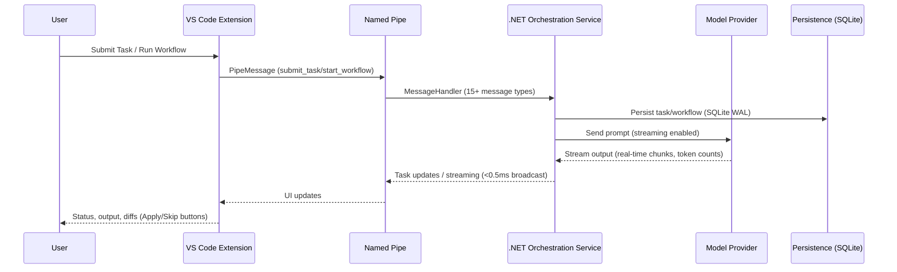

# SAG(Structured Agent Graph) IDE

Local-first deterministic workflow + RAG runtime for agent-native engineering.

Built as a .NET 9 orchestration service with SQLite WAL persistence, prompt registry/templates, scheduler, and RAG pipeline (fetch → chunk → embed → vector search) plus a thin VS Code extension. Runs fully local with Ollama; swap to Claude/Codex/Gemini by adding keys.

## What makes this different
- Local-first, provider-agnostic: works fully offline with Ollama; affinity routing spans local/cloud (Claude/Codex/Gemini) and multiple Ollama hosts.
- Workflow + RAG: queueing/scheduling, DLQ, retries/timeouts, prompt registry/templates, and a built-in RAG pipeline (web fetch/search, chunk, embed, vector search) that feeds orchestrated subtasks.
- Split architecture: orchestration engine in a .NET service; thin VS Code extension over named pipes (<10ms). Broadcasts reach all clients fast and don’t burden the extension host.
- Workflow engine: DAGs, routers, pause/resume, human approval gates, auditable activity logs—closer to a mini Temporal/Airflow than chat UIs.

## Capabilities
- Task orchestration with queueing, scheduler, DLQ, persistence, retry/timeout policies.
- Workflow engine with DAGs/routers/pause/resume/human approval gates, context var substitution ({{var}}), Git-linked activity logging, and prompt registry/templates loaded from `prompts/`.
- RAG pipeline: web fetch/search, text chunking, embeddings, vector search, cache, and safety redaction feeding orchestrated subtasks.
- Multi-provider LLM support (Claude, Codex, Gemini, Ollama) with streaming, token counting, structured parsing, and affinity-based model routing across multiple Ollama hosts.
- VS Code UI: Active Tasks, History, DLQ, Workflow Explorer graph, Streaming Output, Diff Approval, Comparison panel, Problems integration.
- Extras: CLI (`tools/cli/sag`), Logseq plugin scaffold, build/deploy helpers (`utils/*.ps1`/`.sh`), comparison groups, configurable concurrency.

## Architecture (high level)

### Task and workflow path


### Why named pipes
- Keeps the extension host lean; orchestration/state lives in the isolated .NET process with bidirectional IPC and per-client write locks.
- Avoids Node event-loop stalls under heavy streaming with concurrent task queue, retry policies, and timeout management.
- Works cross-platform; service can be restarted independently of VS Code. Binary framing (4-byte length prefix) ensures message boundary integrity.
- ProviderFactory routes tasks to 4 HTTP providers (Claude, Codex, Gemini), Ollama, or TensorRT-LLM with affinity-based server selection.

## Updates (2026-02-28)
- Observability and DI cleanup — Added /api/metrics with cumulative counts and gauges, centralized DI setup via AddSagide* extension methods, and enabled OpenAPI export for development.
- Workflow resilience and performance — SLA deadlines on human-approval steps persist across restarts, approval timers are re-scheduled on recovery, and DAG evaluation now uses reverse dependencies to avoid O(n) scans.
- Finance assets —  finance prompts for daily stock screens plus on-demand stock analysis.


## Updates (2026-02-27)

- Research report improvements — Fixed the web dashboard's prompt variable input parser, which was silently failing to pass "key": "value" pairs. Changed report output filenames from a static -weekly suffix to a topic-derived keyword slug (e.g. 2026-02-27-subject_slug.md).

- Build pipeline and extension hardening — Fixed build script, eliminated hardcoded http://localhost:5100 URL baked into the VS Code extension — it now reads from the sagIDE.serviceUrl workspace setting.

## Updates (2026-02-26)
- Dynamic weekly digest now plans sections with Scriban templating, replacing fixed headings and hardcoded query categories.
- Pipe security tightened with optional shared-secret handshake across service, extension, and client; logging gains safe redaction plus expanded template rendering.
- Resilience and recovery strengthened with new workflow/orchestrator/provider tests, refined SubtaskCoordinator/WorkflowEngine behavior, and hardened pipe/message handling.

## Updates (2026-02-25)
- Added full RAG pipeline and orchestration stack (workflow engine, prompt registry/templates, subtask coordinator, scheduler, RAG fetch/chunk/embed/vector store/search) with new API endpoints and resilience/plumbing updates.
- Refreshed clients and tooling: VS Code extension prompt library/commands, CLI entry point, Logseq plugin scaffolding, deployment/run scripts (Ollama/Searxng), and config adjustments for providers/models.
- Introduced comprehensive test suite and prompt assets (robotics, summarization, code review), plus new samples/build templates to validate agent routing, RAG flows, scheduler, providers, and endpoints.

## Updates (2026-02-21)
- Local-first stack steady: .NET 9 service, SQLite WAL persistence, named pipes <10ms, affinity routing across Claude/Codex/Gemini/Ollama/TensorRT-LLM.
- Workflow engine stable: DAGs/routers, pause/resume, approval gates with diffs, Git-linked activity logs survive editor restarts.
- Comparison + reliability: grouped multi-model runs with token-counted streaming and <0.5ms broadcasts; DLQ with retry/discard and backoff; 50-entry history cap; Active Tasks/History/DLQ/Workflow Explorer/Streaming Output/Diff Approval/Problems panels remain consistent.

## Updates (2026-02-20)
- Shipped: orchestration with DLQ/persistence (SQLite WAL), multi-provider streaming UI (real-time chunks with token counts), workflow engine (DAGs, routers, approval gates, pause/resume), Git-linked activity logging (markdown generation), comparison groups (all N models side-by-side), diagnostics (issues parsed to Problems panel).
- In progress: harden streaming reliability at high token rates (>500 tok/sec), expand workflow templates (security audit, API generation, code migration), improve DLQ UI (batch retry, error categorization).

## Prerequisites (summary)
- OS: Windows 10/11 (full named-pipe support)
- Runtime/tooling: .NET SDK 9.0, Node.js 20+ (npm 10+), VS Code 1.85+
- Packaging: `vsce` (`npm install -g @vscode/vsce`) to build the VSIX
- Models: Ollama with at least one model (e.g., `qwen2.5-coder:7b-instruct`) and `nomic-embed-text` for RAG; cloud keys optional (Anthropic/OpenAI/Google)
- Optional: SearXNG for web search, Logseq 0.9+ if using the plugin

## First-time setup
1) Clone
```bash
git clone https://github.com/sanjeevakumarh/SAGExtention.git
cd SAGExtention
```

2) Configure
- Copy `src/SAGIDE.Service/appsettings.Template.json` to `src/SAGIDE.Service/appsettings.json`.
- Fill API keys (Anthropic/OpenAI/Google) and set Ollama server/models and optional `Rag.SearchUrl` (SearXNG).
- Align VS Code setting `sagIDE.pipeName` with `SAGIDE:NamedPipeName` (default `SAGIDEPipe`).

3) Install prerequisites
- Verify: `dotnet --version` (9.x), `node --version` (20.x), `npm --version`, `vsce --version`.
- Pull models: `ollama pull qwen2.5-coder:7b-instruct` and `ollama pull nomic-embed-text`.

4) Build, test, deploy
```powershell
./build-all.ps1          # builds service, CLI, extension (packages VSIX), Logseq plugin
dotnet test tests/SAGIDE.Service.Tests
./deploy.ps1             # installs VSIX locally and starts service (if scripted)
```

5) Run the stack
- Service: `dotnet run --project src/SAGIDE.Service/SAGIDE.Service.csproj` (or keep deploy.ps1 running).
- Extension: install `src/vscode-extension/sag-ide-0.1.0.vsix` then press F5 or reload VS Code.
- CLI: `dotnet run --project tools/cli/sag/sag.csproj -- --help`.
- Web dashboard: open `http://localhost:5100`.
- Logseq (optional): load `tools/logseq-plugin/` as unpacked plugin (Developer Mode), set `baseUrl=http://localhost:5100`.

## Use the features 
- VS Code extension: submit tasks (`SAGIDE: Submit Task`), review files, run prompt library items, manage DLQ (retry/discard), compare models, stream output, start/pause/resume workflows, and toggle git auto-commit/activity logging.
- CLI: `sag health`, `sag prompts [domain]`, `sag submit --prompt <domain/name> --var key=val`, `sag status [taskId]`, `sag results`, `sag cancel <taskId>`, `sag reports [domain] [file]`.
- Web dashboard: monitor tasks, prompts, reports, and workflows (cancel/pause/resume) at `http://localhost:5100`.
- Scheduler: add `schedule: "* * * * *"` (cron) to a prompt; scheduler fires and tags results (e.g., `scheduled_finance`).
- Workflows: run via VS Code (`Run Workflow`) or API; supports sequential/parallel, router branches, pause/resume, human approval gates, convergence loops, and restart recovery.
- RAG pipeline: use prompts with `data_collection` (web_api/web_search_batch) and embeddings; ensure `nomic-embed-text` is running in Ollama.
- Logseq plugin: `/sag run`, `/sag status`, `/sag prompts` with insert modes (current-block/new-page/notification-only).
- REST API: `POST /api/tasks`, `GET /api/tasks/{id}`, `POST /api/prompts/{domain}/{name}/run`, `GET /api/reports`.

## Quick validation
- `curl http://localhost:5100/api/health` → `{"status":"ok"...}`
- VS Code status bar shows `SAG: Connected`; prompt library lists domains; tasks stream output.
- `sag status` returns recent tasks; web dashboard shows live task list; scheduler logs firing messages if cron prompts exist.

## Model and RAG configuration
Configuration lives in two places:
- Service: `src/SAGIDE.Service/appsettings.json` (or appsettings.Template.json as a starter)
- Extension: `sagIDE.*` VS Code settings

### Local (Ollama)
1. Install Ollama: https://ollama.com (or TensorRT-LLM for edge devices like Orin Nano / Jetson)
2. Pull a model:
   ```bash
   ollama pull qwen2.5-coder:7b-instruct
   ```
3. Verify:
   ```bash
   ollama list
   ```
4. Verify via HTTP (service health and tags):
   ```bash
   curl http://localhost:11434/api/tags
   ```

Service example (trim to your hosts/models):
```json
{
  "SAGIDE": {
    "PromptsPath": "../../prompts",
    "NamedPipeName": "SAGIDEPipe",
    "MaxConcurrentAgents": 5,
    "Scheduler": { "Enabled": true },
    "Providers": { "Claude": { "MaxTokens": 4096 }, "Gemini": { "MaxTokens": 4096 }, "Codex": { "MaxTokens": 4096 }, "Ollama": { "MaxTokens": 4096 } },
    "Rag": { "EmbeddingBatchSize": 32, "ChunkSize": 1500, "ChunkOverlap": 200, "CacheTtlHours": 4, "RateLimitDelayMs": 1000 },
    "Ollama": {
      "Servers": [
        { "Name": "localhost", "BaseUrl": "http://localhost:11434", "RagOrder": 0, "SearchUrl": "http://localhost:8888", "Models": ["nomic-embed-text", "qwen2.5-coder:7b-instruct"] }
      ]
    },
    "OpenAICompatible": { "Servers": [] },
    "ApiKeys": { "Anthropic": "", "OpenAI": "", "Google": "" }
  }
}
```

### Paid providers
Add keys to `appsettings.json` under `SAGIDE:ApiKeys`:
```json
{
  "SAGIDE": {
    "ApiKeys": {
      "Anthropic": "YOUR_KEY",
      "OpenAI": "YOUR_KEY",
      "Google": "YOUR_KEY"
    }
  }
}
```
Then select the provider in `SAG: Submit Task`.


## Defining Workflows and Prompts (YAML)
- Prompts/templates live under `prompts/` and are loaded by the Prompt Registry.
- Workflows live in `.sagide/workflows/*.yaml` (or built-in templates); they support DAG dependencies, conditional routing, context vars, human approval gates, and convergence policies.

```yaml
name: "Refactor and Test"
description: "Refactors code with approval, then generates tests"
params:
  - name: file_path
    description: "Target file"
  - name: quality_target
    description: "refactor for readability or performance"
    default: "readability"
steps:
  - id: refactor
    type: agent
    agent: Refactoring
    modelId: claude-3-sonnet
    prompt: "Refactor {{file_path}} for {{quality_target}}. Output unified diffs."
    maxIterations: 1
    
  - id: wait_approval
    type: human_approval
    prompt: "Review refactoring diffs in {{refactor.output}}. Proceed with tests?"
    slaHours: 1
    depends_on: [refactor]
    
  - id: tests
    type: agent
    agent: TestGeneration
    depends_on: [wait_approval]
    modelId: gpt-4o-mini
    prompt: "Generate unit tests for the refactored code in {{refactor.output}}. Aim for >80% coverage."
    maxIterations: 1

convergencePolicy:
  maxIterations: 2
  escalationTarget: HUMAN_APPROVAL
  partialRetryScope: FAILING_NODES_ONLY
  timeoutPerIterationSec: 120
```


## Verification and FAQ

### Quick connectivity check
- `ollama list` shows at least one model (if using local).
- Service terminal shows `dotnet run` logs with NamedPipeServer listening on the configured pipe name (Windows: `\\.\pipe\SAGIDEPipe` or Unix: `/tmp/SAGIDEPipe`).
- VS Code status bar shows `$(check) SAG: Connected`; Output panel → `SAG IDE` shows heartbeat/connection logs.

### How do I run only local models?
- Install Ollama, pull a model: `ollama pull qwen2.5-coder:7b-instruct`.
- In `SAG: Submit Task`, select your Ollama model from the list (detected via ProviderFactory affinity routing).
- Leave `SAGIDE:ApiKeys` section empty in `appsettings.json` (no cloud keys configured = no cloud access).

### How do I fix "Service not running"?
- Start the backend: `cd src/SAGIDE.Service && dotnet run` (will log NamedPipeServer startup and DI registration).
- Verify `sagIDE.pipeName` in VS Code settings matches `SAGIDE:NamedPipeName` in `appsettings.json` (default: `SAGIDEPipe`).
- Check firewall: Windows Defender may block named pipes on first run (allow when prompted).
- If extension shows "Disconnected" but service is running, extension auto-reconnects every 3 seconds (exponential backoff).

### Where do workflows live?
- Built-in workflows: shipped with the service (in memory, loaded by WorkflowEngine on startup).
- Custom workflows: `.sagide/workflows/*.yaml` in your workspace root (parsed by AgentOrchestrator during `start_workflow` message handling).
- Syntax validation: DAG topological sort, step type validation (agent/router/tool/constraint/human_approval), dependency resolution.

## Troubleshooting quick links
- Ollama install: https://ollama.com
- Service logs: `src/SAGIDE.Service/logs/` (Serilog, daily rolling files, Info+ level)
- Extension logs: Output panel → `SAG IDE` (connects, submits tasks, receives broadcasts)
- Named pipe (Windows): Resource Monitor → Handles, search for `SAGIDEPipe` to verify listening
- Streaming stalls: Check agent output token rate; if <100 tok/sec, model may be overloaded or rate-limited
- DLQ inspection: `sagIDE.showDlq` command shows failed tasks with error codes and retry counts

## Roadmap 
- Harden streaming reliability at high token rates (>1000 tok/sec agents).
- Expand workflow templates (security audit, API generation, code migration templates).
- Improve DLQ UI (batch retry, error classification, escalation alerts).

