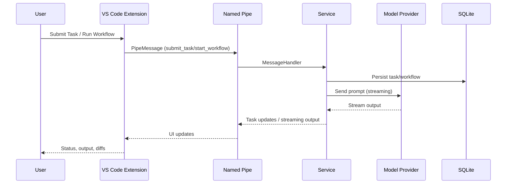

# AgentIDE

Multi-agent orchestration for VS Code with a fast .NET backend. Run local models (Ollama) or paid models (Claude, Codex, Gemini) with streaming output, workflows, and guardrails.

## Why this exists
- Build-and-ship posture: download, run, and ship changes from VS Code without cloud lock-in.
- Local-first: Ollama works offline; swap to Claude/Codex/Gemini by adding keys.
- Designed for speed: named pipes to a .NET service keep UI responsive while agents work.

## Capabilities
- Task orchestration with queueing, scheduling, DLQ, and persistence.
- Workflow engine with DAGs, router nodes, pause/resume, and history.
- Multi-provider support (Claude, Codex, Gemini, Ollama) with streaming output.
- VS Code UI: Active Tasks, History, DLQ, Workflow Explorer, diagnostics.
- Resilience: retry/timeout policies, dead-letter handling, Git-linked activity logging.

## Architecture (high level)

### Task and workflow



#### Status (Feb 19, 2026)
- Shipped: orchestration + DLQ, multi-provider streaming UI, workflow engine with DAGs, diagnostics/history, Git-linked logging.
- Known gaps (directional): tighten streaming reliability; surface parsed changes/issues in UI; finish workflow UI wiring.

## Quickstart

### Prerequisites
- VS Code 1.85+
- .NET SDK 9.0
- Node.js 18+ and npm
- Optional: Ollama for local models

### 1) Clone
```bash
git clone https://github.com/yourusername/AgentIDE.git
cd AgentIDE
```

### 2) Start the service
```bash
cd src/AgenticIDE.Service
dotnet run
```
Leave this running; it hosts named pipes, orchestration, and persistence.

### 3) Start the VS Code extension
1. Open the repo in VS Code.
2. Open `src/vscode-extension`.
3. Install deps:
   ```bash
   npm install
   ```
4. Press F5 to launch the Extension Development Host.

### 4) Run a task
- In the Extension Host window, open a code file.
- Press Ctrl+Shift+P (Command Palette) and run `SAG: Submit Task`.
- Choose an agent and model (local or paid).
- Watch Active Tasks and Streaming Output panes.

## Model configuration
Configuration lives in two places:
- Service: `src/AgenticIDE.Service/appsettings.json`
- Extension: `sagIDE.*` VS Code settings

### Local (Ollama)
1. Install Ollama: https://ollama.com
2. Pull a model:
   ```bash
   ollama pull qwen2.5-coder:7b-instruct
   ```
3. Verify:
   ```bash
   ollama list
   ```
4. Verify via HTTP (service health and tags):
  ```bash
  curl http://localhost:11434/api/tags
  ```

Service example:
```json
{
  "AgenticIDE": {
    "NamedPipeName": "AgenticIDEPipe",
    "MaxConcurrentAgents": 5,
    "Ollama": {
      "DefaultServer": "http://localhost:11434",
      "Servers": [
        {
          "Name": "localhost",
          "BaseUrl": "http://localhost:11434",
          "Models": ["qwen2.5-coder:7b-instruct"]
        }
      ]
    }
  }
}
```

### Paid 
Add keys to `appsettings.json` under `AgenticIDE:ApiKeys`:
```json
{
  "AgenticIDE": {
    "ApiKeys": {
      "Anthropic": "YOUR_KEY",
      "OpenAI": "YOUR_KEY",
      "Google": "YOUR_KEY"
    }
  }
}
```
Then select the provider in `SAG: Submit Task`.

## Verification and FAQ

### Quick connectivity check
- `ollama list` shows at least one model (if using local).
- Service terminal shows `dotnet run` logs with no pipe errors.
- VS Code status bar shows `SAG: Connected`; Output panel has a `SAG IDE` channel.

### How do I run only local models?
- Install Ollama, pull a model, select it in `SAG: Submit Task`.
- Leave cloud API keys empty in `appsettings.json`.

### How do I fix "Service not running"?
- Start the backend with `dotnet run`.
- Ensure `sagIDE.pipeName` matches `AgenticIDE:NamedPipeName`.

### Where do workflows live?
- Built-ins ship with the service.
- Custom workflows live under `.agentide/workflows` in your workspace.

## Troubleshooting quick links
- Ollama install: https://ollama.com
- Service logs: terminal running `dotnet run`
- Extension logs: Output panel → `SAG IDE`

## Roadmap (short)
- Harden streaming reliability and UI state updates.
- Expand workflow templates and policy checks.
- Improve handling for large files and long-running tasks.
```
