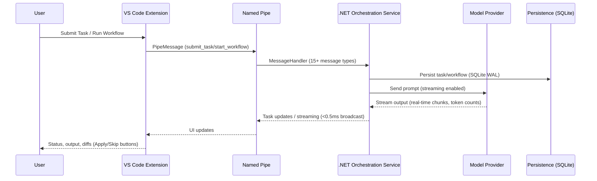

# SAG(Structured Agent Graph) IDE

Local-first deterministic workflow runtime for agent-native engineering.

Built as a .NET 9 orchestration service with SQLite WAL persistence plus a thin VS Code extension (5 interactive panels, <10ms latency broadcasts). Runs fully local with Ollama or TensorRT-LLM (edge devices like Orin Nano); swap to Claude, Codex, or Gemini by adding keys.

## What makes this different
- Local-first, provider-agnostic: works fully offline with Ollama or TensorRT-LLM (edge devices: Orin Nano, Jetson, etc.); 6 agent types × N models with affinity routing—no Copilot-first bias.
- Workflow-first: queueing/scheduling, persistence, DLQ, and policy-driven retry/timeout policies (exponential backoff, fixed backoff) make it a small workflow platform embedded in the editor. Tasks persist to completion even if the editor closes.
- Split architecture: orchestration engine lives in a .NET service; the VS Code extension is a thin UI connected over named pipes with <10ms round-trip latency. Status broadcasts reach all clients in <0.5ms.
- Workflow engine: DAGs, conditional routers, pause/resume, human approval gates ("WaitingApproval" status with diff review), and auditable activity logs—closer to a mini Temporal/Airflow than typical agent chat wrappers.

## Capabilities
- Task orchestration with queueing, scheduling, DLQ, persistence, retry/timeout policies, and 50-entry history limit.
- Workflow engine with DAGs, router nodes, pause/resume, human approval gates, context variable substitution ({{var}}) during execution, and Git-linked activity logging.
- Multi-provider LLM support (Claude, Codex, Gemini, Ollama) with real-time streaming output, token counting, and structured JSON/markdown parsing for issues (file/line/severity/fix) and file changes.
- VS Code UI: Active Tasks tree, History (50 entries), DLQ with retry/discard, Workflow Explorer with DAG graph visualization, Streaming Output panel, Diff Approval panel with Apply/Skip per-file, Comparison panel (side-by-side multi-model results), Problems panel integration.
- Comparison groups: submit the same task description to N models, track all as a group, show side-by-side results when all complete.
- Configurable concurrency: max_concurrent_agents (default 5), per-provider timeout overrides, task priority queue.

## Architecture (high level)

### Task and workflow path


### Why named pipes
- Keeps the extension host lean; orchestration/state lives in the isolated .NET process with bidirectional IPC and per-client write locks.
- Avoids Node event-loop stalls under heavy streaming with concurrent task queue, retry policies, and timeout management.
- Works cross-platform; service can be restarted independently of VS Code. Binary framing (4-byte length prefix) ensures message boundary integrity.
- ProviderFactory routes tasks to 4 HTTP providers (Claude, Codex, Gemini), Ollama, or TensorRT-LLM with affinity-based server selection.

## Updates (2026-02-25)
- Added full RAG pipeline and orchestration stack (workflow engine, prompt registry/templates, subtask coordinator, scheduler, RAG fetch/chunk/embed/vector store/search) with new API endpoints and resilience/plumbing updates.
- Refreshed clients and tooling: VS Code extension prompt library/commands, CLI entry point, Logseq plugin scaffolding, deployment/run scripts (Ollama/Searxng), and config adjustments for providers/models.
- Introduced comprehensive test suite and prompt assets (robotics, summarization, code review), plus new samples/build templates to validate agent routing, RAG flows, scheduler, providers, and endpoints.

## Updates (2026-02-21)
- Local-first stack steady: .NET 9 service, SQLite WAL persistence, named pipes <10ms, affinity routing across Claude/Codex/Gemini/Ollama/TensorRT-LLM.
- Workflow engine stable: DAGs/routers, pause/resume, approval gates with diffs, Git-linked activity logs survive editor restarts.
- Comparison + reliability: grouped multi-model runs with token-counted streaming and <0.5ms broadcasts; DLQ with retry/discard and backoff; 50-entry history cap; Active Tasks/History/DLQ/Workflow Explorer/Streaming Output/Diff Approval/Problems panels remain consistent.

## Updates (2026-02-20)
- Shipped: orchestration with DLQ/persistence (SQLite WAL), multi-provider streaming UI (real-time chunks with token counts), workflow engine (DAGs, routers, approval gates, pause/resume), Git-linked activity logging (markdown generation), comparison groups (all N models side-by-side), diagnostics (issues parsed to Problems panel).
- In progress: harden streaming reliability at high token rates (>500 tok/sec), expand workflow templates (security audit, API generation, code migration), improve DLQ UI (batch retry, error categorization).

## Quickstart

### Prerequisites
- VS Code 1.85+
- .NET SDK 9.0
- Node.js 18+ and npm
- Optional: Ollama for local models

### 1) Clone
```bash
git clone https://github.com/sanjeevakumarh/SAGExtention.git
cd SAGExtention
```

### 2) Start the orchestration service
```bash
cd src/SAGIDE.Service
dotnet run
```
Leave this running; it hosts named pipes, task orchestration with concurrent execution and queue, SQLite WAL persistence (~50 task history limit), and provider routing to Claude, Codex, Gemini, or Ollama.

### 3) Start the VS Code extension
1. Open the repo in VS Code.
2. Open `src/vscode-extension`.
3. Install deps:
   ```bash
   npm install
   ```
4. Press F5 to launch the Extension Development Host.

### 4) Run a task or workflow
- In the Extension Host window, open a code file.
- Press Ctrl+Shift+P and run `SAG: Submit Task`.
- Choose an agent and model (local or paid).
- Watch Active Tasks, Streaming Output, and History panes.

## Model configuration
Configuration lives in two places:
- Service: `src/SAGIDE.Service/appsettings.json`
- Extension: `sagIDE.*` VS Code settings

### Local (Ollama or TensorRT-LLM)
1. Install Ollama: https://ollama.com (or TensorRT-LLM for edge devices like Orin Nano / Jetson)
2. Pull a model:
   ```bash
   ollama pull qwen2.5-coder:7b-instruct
   ```
3. Verify:
   ```bash
   ollama list
   ```
4. Verify via HTTP (service health and tags):
   ```bash
   curl http://localhost:11434/api/tags
   ```

Service example:
```json
{
  "AgenticIDE": {
    "NamedPipeName": "AgenticIDEPipe",
    "MaxConcurrentAgents": 5,
    "Ollama": {
      "DefaultServer": "http://localhost:11434",
      "Servers": [
        {
          "Name": "localhost",
          "BaseUrl": "http://localhost:11434",
          "Models": ["qwen2.5-coder:7b-instruct"]
        }
      ]
    }
  }
}
```

### Paid providers
Add keys to `appsettings.json` under `AgenticIDE:ApiKeys`:
```json
{
  "AgenticIDE": {
    "ApiKeys": {
      "Anthropic": "YOUR_KEY",
      "OpenAI": "YOUR_KEY",
      "Google": "YOUR_KEY"
    }
  }
}
```
Then select the provider in `SAG: Submit Task`.


## Defining Workflows (YAML)
Workflows live in `.agentide/workflows/*.yaml`. They support DAG dependencies, conditional routing (if: "{{condition}}"), context variable passing ({{var}} substitution), human approval gates ("WaitingApproval" status), and convergence policies (retry scoping, timeout per iteration, escalation targets).

```yaml
name: "Refactor and Test"
description: "Refactors code with approval, then generates tests"
params:
  - name: file_path
    description: "Target file"
  - name: quality_target
    description: "refactor for readability or performance"
    default: "readability"
steps:
  - id: refactor
    type: agent
    agent: Refactoring
    modelId: claude-3-sonnet
    prompt: "Refactor {{file_path}} for {{quality_target}}. Output unified diffs."
    maxIterations: 1
    
  - id: wait_approval
    type: human_approval
    prompt: "Review refactoring diffs in {{refactor.output}}. Proceed with tests?"
    slaHours: 1
    depends_on: [refactor]
    
  - id: tests
    type: agent
    agent: TestGeneration
    depends_on: [wait_approval]
    modelId: gpt-4o-mini
    prompt: "Generate unit tests for the refactored code in {{refactor.output}}. Aim for >80% coverage."
    maxIterations: 1

convergencePolicy:
  maxIterations: 2
  escalationTarget: HUMAN_APPROVAL
  partialRetryScope: FAILING_NODES_ONLY
  timeoutPerIterationSec: 120
```


## Verification and FAQ

### Quick connectivity check
- `ollama list` shows at least one model (if using local).
- Service terminal shows `dotnet run` logs with NamedPipeServer listening on the configured pipe name (Windows: `\\.\pipe\AgenticIDEPipe` or Unix: `/tmp/AgenticIDEPipe`).
- VS Code status bar shows `$(check) SAG: Connected`; Output panel → `SAG IDE` shows heartbeat/connection logs.

### How do I run only local models?
- Install Ollama, pull a model: `ollama pull qwen2.5-coder:7b-instruct`.
- In `SAG: Submit Task`, select your Ollama model from the list (detected via ProviderFactory affinity routing).
- Leave `AgenticIDE:ApiKeys` section empty in `appsettings.json` (no cloud keys configured = no cloud access).

### How do I fix "Service not running"?
- Start the backend: `cd src/SAGIDE.Service && dotnet run` (will log NamedPipeServer startup and DI registration).
- Verify `sagIDE.pipeName` in VS Code settings matches `AgenticIDE:NamedPipeName` in `appsettings.json` (default: `AgenticIDEPipe`).
- Check firewall: Windows Defender may block named pipes on first run (allow when prompted).
- If extension shows "Disconnected" but service is running, extension auto-reconnects every 3 seconds (exponential backoff).

### Where do workflows live?
- Built-in workflows: shipped with the service (in memory, loaded by WorkflowEngine on startup).
- Custom workflows: `.agentide/workflows/*.yaml` in your workspace root (parsed by AgentOrchestrator during `start_workflow` message handling).
- Syntax validation: DAG topological sort, step type validation (agent/router/tool/constraint/human_approval), dependency resolution.

## Troubleshooting quick links
- Ollama install: https://ollama.com
- Service logs: `src/SAGIDE.Service/logs/` (Serilog, daily rolling files, Info+ level)
- Extension logs: Output panel → `SAG IDE` (connects, submits tasks, receives broadcasts)
- Named pipe (Windows): Resource Monitor → Handles, search for `AgenticIDEPipe` to verify listening
- Streaming stalls: Check agent output token rate; if <100 tok/sec, model may be overloaded or rate-limited
- DLQ inspection: `sagIDE.showDlq` command shows failed tasks with error codes and retry counts

## Roadmap (short)
- Harden streaming reliability at high token rates (>1000 tok/sec agents).
- Expand workflow templates (security audit, API generation, code migration templates).
- Improve DLQ UI (batch retry, error classification, escalation alerts).

