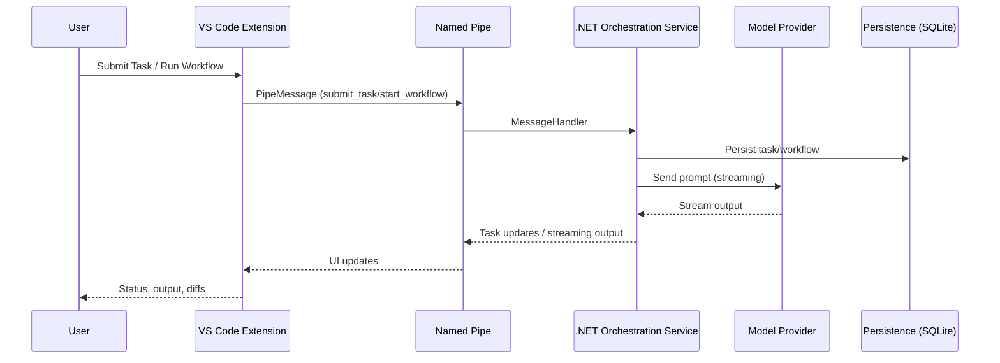

# AgentIDE

Local-first deterministic workflow runtime for agent-native engineering.

Built as a .NET orchestration service (queueing, scheduling, DLQ, persistence, retry/timeout policies, history) plus a thin VS Code surface for task/agent control. Runs fully local with Ollama; swap to Claude, Codex, or Gemini by adding keys.

## What makes this different
- Workflow-first: queueing/scheduling, persistence, DLQ, and policy-driven retries timeouts make it a small workflow platform embedded in the editor.
- Local-first, provider-agnostic: works fully offline with Ollama; swap to Claude/Codex/Gemini by adding keys—no Copilot-first bias.
- Split architecture: orchestration lives in a .NET service; the VS Code extension is a thin UI connected over named pipes to stay responsive under load.
- Workflow engine: DAGs, router nodes, pause/resume, and auditable history—closer to a mini Temporal/Airflow than typical agent chat wrappers.

## Capabilities
- Task orchestration with queueing, scheduling, DLQ, persistence, retry/timeout policies, and history.
- Workflow engine with DAGs, router nodes, pause/resume, and Git-linked activity logging.
- Multi-provider LLM support (Claude, Codex, Gemini, Ollama) with streaming output.
- VS Code UI: Active Tasks, History, DLQ, Workflow Explorer, diagnostics.

## Architecture (high level)

### Task and workflow path


### Why named pipes
- Keeps the extension host lean; orchestration/state lives in the .NET process.
- Avoids Node event-loop stalls under heavy streaming.
- Works cross-platform; service can be restarted independently of the UI.

## Status (2026-02-20)
- Shipped: orchestration with DLQ/persistence/policies, multi-provider streaming UI, workflow engine (DAGs, router nodes, pause/resume, history), Git-linked logging.
- In progress: harden streaming reliability, surface parsed changes/issues in UI, finish workflow UI wiring.

## Quickstart

### Prerequisites
- VS Code 1.85+
- .NET SDK 9.0
- Node.js 18+ and npm
- Optional: Ollama for local models

### 1) Clone
```bash
git clone https://github.com/yourusername/AgentIDE.git
cd AgentIDE
```

### 2) Start the orchestration service
```bash
cd src/AgenticIDE.Service
dotnet run
```
Leave this running; it hosts named pipes, orchestration, and persistence.

### 3) Start the VS Code extension
1. Open the repo in VS Code.
2. Open `src/vscode-extension`.
3. Install deps:
   ```bash
   npm install
   ```
4. Press F5 to launch the Extension Development Host.

### 4) Run a task or workflow
- In the Extension Host window, open a code file.
- Press Ctrl+Shift+P and run `SAG: Submit Task`.
- Choose an agent and model (local or paid).
- Watch Active Tasks, Streaming Output, and History panes.

## Model configuration
Configuration lives in two places:
- Service: `src/AgenticIDE.Service/appsettings.json`
- Extension: `sagIDE.*` VS Code settings

### Local (Ollama)
1. Install Ollama: https://ollama.com
2. Pull a model:
   ```bash
   ollama pull qwen2.5-coder:7b-instruct
   ```
3. Verify:
   ```bash
   ollama list
   ```
4. Verify via HTTP (service health and tags):
   ```bash
   curl http://localhost:11434/api/tags
   ```

Service example:
```json
{
  "AgenticIDE": {
    "NamedPipeName": "AgenticIDEPipe",
    "MaxConcurrentAgents": 5,
    "Ollama": {
      "DefaultServer": "http://localhost:11434",
      "Servers": [
        {
          "Name": "localhost",
          "BaseUrl": "http://localhost:11434",
          "Models": ["qwen2.5-coder:7b-instruct"]
        }
      ]
    }
  }
}
```

### Paid providers
Add keys to `appsettings.json` under `AgenticIDE:ApiKeys`:
```json
{
  "AgenticIDE": {
    "ApiKeys": {
      "Anthropic": "YOUR_KEY",
      "OpenAI": "YOUR_KEY",
      "Google": "YOUR_KEY"
    }
  }
}
```
Then select the provider in `SAG: Submit Task`.


## Defining Workflows (YAML)
Workflows live in `.agentide/workflows/*.yaml`. They support DAG dependencies, conditional routing, and context passing.

```yaml
name: "Refactor and Test"
description: "Refactors code and generates tests"
params:
  - name: file_path
    description: "Target file"
steps:
  - id: refactor
    model: deepseek-coder:6.7b
    prompt: "Refactor {{file_path}} to improve readability."
    
  - id: review
    model: claude-3-opus
    depends_on: [refactor]
    prompt: "Review the refactoring in {{refactor.output}}. Approve or request changes."
    
  - id: generate_tests
    model: gpt-4
    depends_on: [review]
    if: "{{review.approved}} == true"
    prompt: "Generate unit tests for {{file_path}}."
```


## Verification and FAQ

### Quick connectivity check
- `ollama list` shows at least one model (if using local).
- Service terminal shows `dotnet run` logs with no pipe errors.
- VS Code status bar shows `SAG: Connected`; Output panel has a `SAG IDE` channel.

### How do I run only local models?
- Install Ollama, pull a model, select it in `SAG: Submit Task`.
- Leave cloud API keys empty in `appsettings.json`.

### How do I fix "Service not running"?
- Start the backend with `dotnet run`.
- Ensure `sagIDE.pipeName` matches `AgenticIDE:NamedPipeName`.

### Where do workflows live?
- Built-ins ship with the service.
- Custom workflows live under `.agentide/workflows` in your workspace.

## Troubleshooting quick links
- Ollama install: https://ollama.com
- Service logs: terminal running `dotnet run`
- Extension logs: Output panel → `SAG IDE`

## Roadmap (short)
- Harden streaming reliability and UI state updates.
- Expand workflow templates and policy checks.
- Improve handling for large files and long-running tasks.

