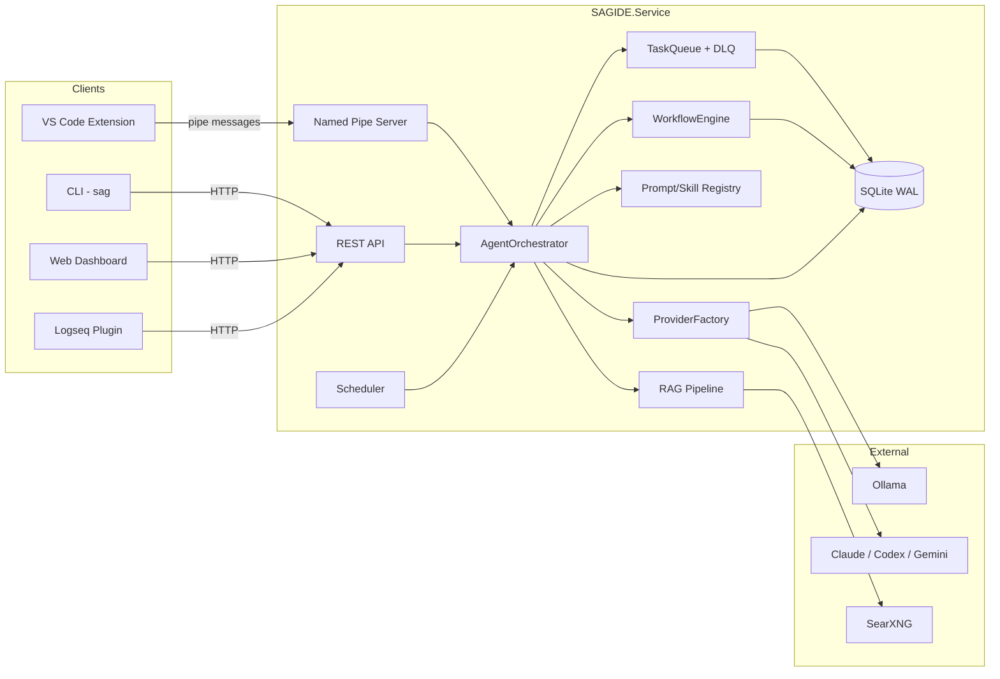

# SAG(Structured Agent Graph) IDE

Local-first deterministic workflow + RAG runtime for agent-native engineering.

A .NET 9 orchestration service with SQLite WAL persistence, prompt/skill registries, scheduler, and RAG pipeline (fetch → chunk → embed → vector search). Multiple clients connect via REST API and named-pipe IPC: a VS Code extension, a CLI, a Logseq plugin, and a built-in web dashboard. Runs fully local with Ollama or LM Studio; swap to Claude/Codex/Gemini by adding keys.

## What makes this different
- Local-first, provider-agnostic: works fully offline with Ollama or LM Studio; affinity routing spans local/cloud (Claude/Codex/Gemini) and multiple Ollama hosts.
- Service is the product: a self-contained orchestration platform exposing REST + named-pipe IPC. Clients (VS Code, CLI, Logseq, web dashboard) are thin and interchangeable.
- Workflow + RAG: queueing/scheduling, DLQ, retries/timeouts, prompt/skill registry/templates, and a built-in RAG pipeline (web fetch/search, chunk, embed, vector search) that feeds orchestrated subtasks.
- Workflow engine: DAGs, routers, pause/resume, human approval gates, auditable activity logs—closer to a mini Temporal/Airflow than chat UIs.

## Capabilities
- Task orchestration with queueing, scheduler, DLQ, persistence, retry/timeout policies.
- Workflow engine with DAGs/routers/pause/resume/human approval gates, context var substitution ({{var}}), Git-linked activity logging, prompt registry/templates loaded from `prompts/`, and skill registry loaded from `skills/`.
- RAG pipeline: web fetch/search, text chunking, embeddings, vector search, cache, and safety redaction feeding orchestrated subtasks.
- Multi-provider LLM support (Claude, Codex, Gemini, Ollama) with streaming, token counting, structured parsing, and affinity-based model routing across multiple Ollama hosts.
- Quality scoring, workflow policy enforcement (protected paths, max steps), audit logging, and run tracing.
- Clients: VS Code extension (Active Tasks, History, DLQ, Workflow Explorer, Streaming Output, Diff Approval), CLI (`sag`), web dashboard at `http://localhost:5100`, Logseq plugin scaffold.
- Extras: 39 skill definitions (`skills/`), build/deploy/validation PowerShell scripts, comparison groups, configurable concurrency.

## Architecture

### Service modules (`src/SAGIDE.*`)

The orchestration service is the core of the system. It is split across 7 projects:

| Project | Responsibility |
|---------|----------------|
| **SAGIDE.Service** | Host: ASP.NET Core Kestrel, named-pipe server, REST API (12 endpoint groups), web dashboard (`wwwroot/`) |
| **SAGIDE.Contracts** | Interfaces: `IPromptRegistry`, `ISkillRegistry`, `PromptDefinition`, `SkillDefinition` |
| **SAGIDE.Core** | Domain models, DTOs, events |
| **SAGIDE.Workflows** | Workflow engine: DAG evaluation, step dispatch, approval gates, loop control, instance store, policy engine, run tracing |
| **SAGIDE.ModelRouter** | Capability-based model routing, quality sampling |
| **SAGIDE.Memory** | RAG pipeline: `WebFetcher`, `WebSearchAdapter`, `TextChunker`, `EmbeddingService`, `VectorStore`, `NotesIndexerService` |
| **SAGIDE.Security** | Bearer-token auth (HMAC constant-time), SQLite audit log |
| **SAGIDE.Observability** | OpenTelemetry tracing (ASP.NET Core, HttpClient, OTLP exporters) |
| **SAGIDE.Tools** | In-process tool registry for agent tool calls |

### Service internals (`src/SAGIDE.Service/`)

```
SAGIDE.Service/
├── Api/               REST endpoints (12 groups)
│   ├── TaskEndpoints.cs        /api/tasks
│   ├── PromptEndpoints.cs      /api/prompts
│   ├── SkillsEndpoints.cs      /api/skills
│   ├── ResultEndpoints.cs      /api/results
│   ├── ReportsEndpoints.cs     /api/reports
│   ├── NotesEndpoints.cs       /api/notes
│   ├── MetricsEndpoints.cs     /api/metrics
│   ├── MemoryEndpoints.cs      /api/memory
│   └── ...
├── Communication/     Named-pipe IPC
│   ├── NamedPipeServer.cs      Multi-client server with binary framing
│   ├── MessageHandler.cs       15+ message types (submit_task, start_workflow, ...)
│   └── Messages/PipeMessage.cs
├── Orchestrator/      Task + workflow coordination
│   ├── AgentOrchestrator.cs    Routes tasks to providers, manages lifecycle
│   ├── SubtaskCoordinator.cs   Expands prompts into subtasks, dispatches, synthesizes
│   ├── TaskQueue.cs            Priority queue with DLQ
│   ├── QualityScorer.cs        Post-run quality evaluation
│   └── Templates/              Built-in workflow YAML (6 templates)
├── Providers/         LLM backends
│   ├── ProviderFactory.cs      Selects provider by name/modelId
│   ├── ClaudeProvider.cs
│   ├── CodexProvider.cs
│   ├── GeminiProvider.cs
│   ├── OllamaProvider.cs       Multi-host with affinity routing
│   └── OllamaHostHealthMonitor.cs
├── Rag/               RAG pipeline (mirrors SAGIDE.Memory)
├── Persistence/       SQLite repositories (11)
│   ├── SqliteTaskRepository.cs
│   ├── SqliteWorkflowRepository.cs
│   ├── SqliteSchedulerRepository.cs
│   ├── SearchCacheRepository.cs
│   └── ...
├── Scheduling/        Cron-based prompt scheduler
├── Prompts/           Prompt/skill file registry
├── Routing/           Capability-based model routing
├── Resilience/        Retry, timeout, circuit-breaker policies
├── Events/            Event bus (broadcast to pipe clients)
└── wwwroot/           Web dashboard (HTML/JS/CSS)
```

### Clients

| Client | Protocol | Source |
|--------|----------|--------|
| **VS Code extension** | Named pipe (IPC) | `src/vscode-extension/` |
| **CLI (`sag`)** | REST API | `tools/cli/sag/` |
| **Web dashboard** | REST API (built-in) | Served from `SAGIDE.Service/wwwroot/` at `/` |
| **Logseq plugin** | REST API | `tools/logseq-plugin/` |

Any HTTP client can consume the REST API; any named-pipe client can subscribe to real-time broadcasts.

### Request flow



### Why named pipes for VS Code
- Keeps the extension host lean; orchestration/state lives in the isolated .NET process with bidirectional IPC and per-client write locks.
- Avoids Node event-loop stalls under heavy streaming with concurrent task queue, retry policies, and timeout management.
- Works cross-platform; service can be restarted independently of VS Code. Binary framing (4-byte length prefix) ensures message boundary integrity.
- Real-time broadcasts (task updates, streaming chunks) reach all connected clients in <0.5ms.

## Updates (2026-03-20)
- README overhaul: architecture redesign positions the .NET service as the core product. Added service modules table (9 projects), service internals tree, clients table (VS Code, CLI, Logseq, web dashboard), and a component-level Mermaid diagram replacing the VS Code-centric sequence diagram.
- LM Studio support documented: `OpenAICompatible` provider config covers LM Studio servers alongside Ollama. README split into Ollama and LM Studio subsections with install/verify steps and config examples.
- PowerShell script audit: fixed `Invoke-EndToEndTest.ps1` referencing `build-all.ps1` at repo root (script lives in `utils/`). README now documents all 18 scripts across build/deploy, testing, infrastructure, and a 10-script validation suite.
- `.gitignore` refresh: added `.planning/` and test result directories (`TestResults/`, `coverage/`, `perfdata/`, `*.trx`, `benchmarkDotNetArtifacts/`, `tmp/`) to exclude build/test/debug artifacts from version control.

## Updates (2026-03-14)
- New `SAGIDE.Contracts` project surfaces Prompt/Skill definitions and registry interfaces; registries now merge file + API registrations, DI exposes interfaces, and prompt/skill endpoints gain register/bulk/delete flows plus typed resolution across orchestrator components and tests.
- Observability spine added via `SAGIDE.Observability`: central ActivitySources, TraceContext, and OpenTelemetry wiring (ASP.NET/Core, HttpClient, OTLP/console exporters) instrument scheduler, named pipes, orchestrator, workflow steps, RAG pipeline, and task spans; Program boots tracing middleware and projects reference the new module.
- Schema and skills tightened: prompt schema adds `web_fetch` with fetchPages/maxCharsPerPage; finance/research/strategy/security/shared skills bump versions with stricter data attribution, valuation rules, decision scoring, and study-guide completeness; appsettings refreshes Ollama model lists; tests cover pipe JSON contract, cache expiry fetcher, and WorkflowInstanceStore reverse-deps.

## Updates (2026-03-09)
- Finance stock analysis now starts with ticker lookup + json_extract, passes fund name/asset type into stock-data-track, and keeps yahoo_quote_data/stockanalysis_data/search_results as separate vars instead of one lossy blob.
- Added web_fetch + HTML text extraction: auto-decompress responses, strip boilerplate with AngleSharp, and allow search steps to pull top result page content via fetchPages/maxCharsPerPage.
- Search quality guardrails: filter dictionary URLs, relevance checks on SearXNG results, new today/current_week/month/year vars for prompts, and default appsettings disable search cache/engine overrides for predictable runs.
- Schema/tests refresh: prompt schema accepts json_extract/web_fetch, new finance ticker-lookup skill, stock-analysis prompt rebuilt with inline steps, and search adapter tests updated for relevance fixtures.

## Updates (2026-03-07)
- Logseq knowledge base pipeline — new notes indexer service with file index + vector store cleanup, API endpoints for search/stats/reindex, and markdown-aware chunking with task markers and source-tagged embeddings.
- Search quality + caching — per-domain TTLs, SQLite-backed search cache with quality scoring, and web search adapter fallbacks; RAG vector store gains delete helpers for source URLs/tags.
- UX for notes discovery — dashboard Notes tab with search + AI summary, new VS Code command/panel (`sagIDE.searchNotes`), and appsettings Notes config defaults (summary model + schedule + exclusions).
- Prompt + skill refresh — finance stock-analysis now uses Logseq vector search for personal context and copies full analyst sections; robotics weekly digest v11 with broader queries and structured briefing; finance skills enforce the `[DATA UNAVAILABLE]` marker and stricter RSI rules; study-guide generator format rules tightened and tests aligned.
- Reliability/tooling — Ollama 500 failover path, capability slot-to-model mapping fixes, vector_search data_collection step, default model for skill debugging, and embedded-model fallback routing.

## Updates (2026-03-06)
- Configurable caching — new SAGIDE:Caching section toggles output caching and sets TTLs for search results, routing hints, and Ollama health polling; AgentOrchestrator now honors the cache enable flag.
- Startup and auth hardening — async DB bootstrap/pruning via hosted service, shared ModelIdParser reused by scheduler/endpoints with tests, and bearer-token guard now HMAC-normalized for constant-time comparison.
- RAG safety nets — embedding resolver logs missing configs and short-circuits cleanly; VectorStore initializes lazily with concurrency guard to avoid startup blocking.
- Extension resilience — pipe connect timeout + lower send default, workspace-only writes in Diff Approval, JSON fetch helper reused across prompt/skill views, and message parsing now shields malformed payloads.
- Prompt/schema refresh — finance stock-analysis guardrails tightened,  skill schema locks capability enums, and research assembler/evaluator prompts clarify GATE_SIGNAL extraction.

## Updates (2026-03-05)
- Workflow schema docs — published docs/workflow-schema.json describing workflow YAML structure (steps, parameters, convergence policy).
- Pipe broadcast controls — new BroadcastAllTasks toggle in CommunicationConfig/appsettings with event-bus routing to limit VS Code updates to task owners.
- Ollama routing resilience — host monitor now tracks installed models and failover only selects servers that have the model; tests cover warm/installed/absent cases.
- Task metadata plumbing — task status DTOs carry SourceTag; AgentOrchestrator failover uses installed-model-aware host selection.

## Updates (2026-02-28)
- Observability and DI cleanup — Added /api/metrics with cumulative counts and gauges, centralized DI setup via AddSagide* extension methods, and enabled OpenAPI export for development.
- Workflow resilience and performance — SLA deadlines on human-approval steps persist across restarts, approval timers are re-scheduled on recovery, and DAG evaluation now uses reverse dependencies to avoid O(n) scans.
- Finance assets —  finance prompts for daily stock screens plus on-demand stock analysis.


## Updates (2026-02-27)

- Research report improvements — Fixed the web dashboard's prompt variable input parser, which was silently failing to pass "key": "value" pairs. Changed report output filenames from a static -weekly suffix to a topic-derived keyword slug (e.g. 2026-02-27-subject_slug.md).

- Build pipeline and extension hardening — Fixed build script, eliminated hardcoded http://localhost:5100 URL baked into the VS Code extension — it now reads from the sagIDE.serviceUrl workspace setting.

## Updates (2026-02-26)
- Dynamic weekly digest now plans sections with Scriban templating, replacing fixed headings and hardcoded query categories.
- Pipe security tightened with optional shared-secret handshake across service, extension, and client; logging gains safe redaction plus expanded template rendering.
- Resilience and recovery strengthened with new workflow/orchestrator/provider tests, refined SubtaskCoordinator/WorkflowEngine behavior, and hardened pipe/message handling.

## Updates (2026-02-25)
- Added full RAG pipeline and orchestration stack (workflow engine, prompt registry/templates, subtask coordinator, scheduler, RAG fetch/chunk/embed/vector store/search) with new API endpoints and resilience/plumbing updates.
- Refreshed clients and tooling: VS Code extension prompt library/commands, CLI entry point, Logseq plugin scaffolding, deployment/run scripts (Ollama/Searxng), and config adjustments for providers/models.
- Introduced comprehensive test suite and prompt assets (robotics, summarization, code review), plus new samples/build templates to validate agent routing, RAG flows, scheduler, providers, and endpoints.

## Updates (2026-02-21)
- Local-first stack steady: .NET 9 service, SQLite WAL persistence, named pipes <10ms, affinity routing across Claude/Codex/Gemini/Ollama/TensorRT-LLM.
- Workflow engine stable: DAGs/routers, pause/resume, approval gates with diffs, Git-linked activity logs survive editor restarts.
- Comparison + reliability: grouped multi-model runs with token-counted streaming and <0.5ms broadcasts; DLQ with retry/discard and backoff; 50-entry history cap; Active Tasks/History/DLQ/Workflow Explorer/Streaming Output/Diff Approval/Problems panels remain consistent.

## Updates (2026-02-20)
- Shipped: orchestration with DLQ/persistence (SQLite WAL), multi-provider streaming UI (real-time chunks with token counts), workflow engine (DAGs, routers, approval gates, pause/resume), Git-linked activity logging (markdown generation), comparison groups (all N models side-by-side), diagnostics (issues parsed to Problems panel).
- In progress: harden streaming reliability at high token rates (>500 tok/sec), expand workflow templates (security audit, API generation, code migration), improve DLQ UI (batch retry, error categorization).

## Prerequisites (summary)
- OS: Windows 10/11 (full named-pipe support)
- Runtime/tooling: .NET SDK 9.0, Node.js 20+ (npm 10+), VS Code 1.85+
- Models: Ollama or LM Studio with at least one model (e.g., `qwen2.5-coder:7b-instruct`) and `nomic-embed-text` for RAG; cloud keys optional (Anthropic/OpenAI/Google)
- Optional: Docker (for SearXNG), Logseq 0.9+ if using the plugin

## First-time setup
1) Clone
```bash
git clone https://github.com/sanjeevakumarh/SAGExtention.git
cd SAGExtention
```

2) Configure
- Edit `src/SAGIDE.Service/appsettings.json` directly.
- Set API keys (Anthropic/OpenAI/Google), Ollama server URLs/models, and optional `Rag`/`Notes` settings.
- Align VS Code setting `sagIDE.pipeName` with `SAGIDE:NamedPipeName` (default `SAGIDEPipe`).

3) Install prerequisites
- Verify: `dotnet --version` (9.x), `node --version` (20.x), `npm --version`.
- Pull models: `ollama pull qwen2.5-coder:7b-instruct` and `ollama pull nomic-embed-text`.
- Optional: run `./utils/validation/Invoke-CodexValidation.ps1` to verify all prerequisites at once.

4) Build, test, deploy
```powershell
./utils/build-all.ps1 -BuildClients   # builds service, CLI, extension (packages VSIX), Logseq plugin
dotnet test tests/SAGIDE.Service.Tests
./deploy.ps1                          # installs VSIX locally and starts service
```

5) Run the stack
- Service: `dotnet run --project src/SAGIDE.Service/SAGIDE.Service.csproj` (or use `./deploy.ps1`).
- Extension: install the VSIX from `src/vscode-extension/` then reload VS Code.
- CLI: `dotnet run --project tools/cli/sag/sag.csproj -- --help`.
- Web dashboard: open `http://localhost:5100`.
- Logseq (optional): load `tools/logseq-plugin/` as unpacked plugin (Developer Mode), set `baseUrl=http://localhost:5100`.

## Use the features 
- VS Code extension: submit tasks (`SAGIDE: Submit Task`), review files, run prompt library items, manage DLQ (retry/discard), compare models, stream output, start/pause/resume workflows, and toggle git auto-commit/activity logging.
- CLI: `sag health`, `sag prompts [domain]`, `sag submit --prompt <domain/name> --var key=val`, `sag status [taskId]`, `sag results [--tag tag] [--since today] [--limit N]`, `sag cancel <taskId>`, `sag reports [domain] [file] [--html]`.
- Web dashboard: monitor tasks, prompts, reports, and workflows (cancel/pause/resume) at `http://localhost:5100`.
- Scheduler: add `schedule: "* * * * *"` (cron) to a prompt; scheduler fires and tags results (e.g., `scheduled_finance`).
- Workflows: run via VS Code (`Run Workflow`) or API; supports sequential/parallel, router branches, pause/resume, human approval gates, convergence loops, and restart recovery.
- RAG pipeline: use prompts with `data_collection` (web_api/web_search_batch) and embeddings; ensure `nomic-embed-text` is running in Ollama.
- Logseq plugin: `/sag run`, `/sag status`, `/sag prompts` with insert modes (current-block/new-page/notification-only).
- REST API: `POST /api/tasks`, `GET /api/tasks/{id}`, `DELETE /api/tasks/{id}`, `POST /api/prompts/{domain}/{name}/run`, `GET /api/reports`.

## Quick validation
- `curl http://localhost:5100/api/health` → `{"status":"ok"...}`
- VS Code status bar shows `SAG: Connected`; prompt library lists domains; tasks stream output.
- `sag status` returns recent tasks; web dashboard shows live task list; scheduler logs firing messages if cron prompts exist.

## PowerShell scripts

### Build and deploy
| Script | Location | Purpose |
|--------|----------|---------|
| `build-all.ps1` | `utils/` | Builds .NET solution, optionally CLI + VS Code extension (VSIX) + Logseq plugin (`-BuildClients`) |
| `deploy.ps1` | root | Installs VSIX, starts backend service, runs health check. Flags: `-SkipExtension`, `-SkipService`, `-InstallCli`, `-Background` |
| `kill-and-start.ps1` | root | Quick dev helper: kills running service, restarts from Release build |
| `clean-all.ps1` | `utils/` | Removes `bin/`, `obj/`, `out/`, `dist/`, `node_modules/`, `*.vsix`, `*.bak`, `package-lock.json` |

### Testing
| Script | Location | Purpose |
|--------|----------|---------|
| `Invoke-EndToEndTest.ps1` | `utils/` | Full pipeline: optional build → start service (isolated temp DB) → smoke tests → teardown |
| `test-runner.ps1` | `tools/` | Batch workflow test runner: submits prompts/skills via API, critiques output with Ollama |
| `OllamaTest.ps1` | `utils/` | Benchmarks an Ollama model with 5 coding prompts, logs timing |

### Infrastructure
| Script | Location | Purpose |
|--------|----------|---------|
| `runSearxng.ps1` | `utils/` | Starts SearXNG Docker container on port 8888 with JSON+HTML output formats |

### Validation suite (`utils/validation/`)
| Script | Checks |
|--------|--------|
| `Invoke-CodexValidation.ps1` | Master orchestrator — runs all checks below |
| `Test-DotNet.ps1` | .NET SDK >= 9.0.0 |
| `Test-NodeNpm.ps1` | Node >= 20, npm >= 10 |
| `Test-Git.ps1` | Git on PATH |
| `Test-Docker.ps1` | Docker engine, compose, buildx |
| `Test-Python.ps1` | Python on PATH |
| `Test-Ollama.ps1` | Ollama reachable, model present |
| `Test-Searxng.ps1` | SearXNG endpoints reachable |
| `Test-Paths.ps1` | `C:\Temp\Logs` writable, >= 10 GB free |
| `Test-SmokeTests.ps1` | 14 REST API smoke tests against running service |

## Model and RAG configuration
Configuration lives in two places:
- Service: `src/SAGIDE.Service/appsettings.json`
- Extension: `sagIDE.*` VS Code settings

### Local (Ollama or LM Studio)

#### Ollama
1. Install Ollama: https://ollama.com (or TensorRT-LLM for edge devices like Orin Nano / Jetson)
2. Pull a model:
   ```bash
   ollama pull qwen2.5-coder:7b-instruct
   ```
3. Verify:
   ```bash
   ollama list
   curl http://localhost:11434/api/tags
   ```

#### LM Studio
1. Install LM Studio: https://lmstudio.ai
2. Download a model and start the local server (Developer tab → Start Server)
3. LM Studio exposes an OpenAI-compatible API — configure it under `SAGIDE:OpenAICompatible:Servers`

#### Service config example
```json
{
  "SAGIDE": {
    "Ollama": {
      "Servers": [
        { "Name": "localhost", "BaseUrl": "http://localhost:11434", "Models": ["qwen2.5-coder:7b-instruct", "nomic-embed-text"] }
      ]
    },
    "OpenAICompatible": {
      "Servers": [
        { "Name": "lmstudio", "BaseUrl": "http://localhost:1234/v1", "Models": ["your-model-name"] }
      ]
    }
  }
}
```

Service example (trim to your hosts/models):
```json
{
  "SAGIDE": {
    "PromptsPath": "../../prompts",
    "SkillsPath": "../../skills",
    "NamedPipeName": "SAGIDEPipe",
    "MaxConcurrentAgents": 5,
    "Scheduler": { "Enabled": true },
    "Providers": { "Claude": { "MaxTokens": 4096 }, "Gemini": { "MaxTokens": 4096 }, "Codex": { "MaxTokens": 16384 }, "Ollama": { "MaxTokens": 4096 } },
    "Rag": { "EmbeddingBatchSize": 32, "ChunkSize": 1500, "ChunkOverlap": 200, "CacheTtlHours": 4, "RateLimitDelayMs": 1000 },
    "Caching": {
      "OutputCacheEnabled": false,
      "SearchCacheTtlMinutes": 0,
      "HealthPollIntervalSeconds": 30,
      "PersistentSearchCacheTtlHours": 0
    },
    "RunTracing": { "Enabled": true, "Path": "~/reports/traces" },
    "Ollama": {
      "Servers": [
        { "Name": "localhost", "BaseUrl": "http://localhost:11434", "RagOrder": 0, "SearchUrl": "http://localhost:8888", "Models": ["nomic-embed-text", "qwen2.5-coder:7b-instruct"] }
      ]
    },
    "OpenAICompatible": {
      "Servers": [
        { "Name": "lmstudio", "BaseUrl": "http://localhost:1234/v1", "Models": ["your-model-name"] }
      ]
    },
    "Routing": {
      "QualitySamplingEnabled": true,
      "SamplingRate": 0.25,
      "Capabilities": {
        "fast_general": "ollama/qwen3:30b-a3b@workstation",
        "deep_analyst": "openai/gpt-oss-120b@gmini",
        "coder": "openai/qwen3-coder-next@gmini"
      }
    },
    "QualityScoring": { "Enabled": true, "Mode": "workflow" },
    "WorkflowPolicy": { "Enabled": true, "MaxStepsPerWorkflow": 50 },
    "Notes": { "Enabled": true, "GraphPath": "/path/to/logseq", "Schedule": "0 0 * * *" },
    "ApiKeys": { "Anthropic": "", "OpenAI": "", "Google": "" }
  }
}
```

### Paid providers
Add keys to `appsettings.json` under `SAGIDE:ApiKeys`:
```json
{
  "SAGIDE": {
    "ApiKeys": {
      "Anthropic": "YOUR_KEY",
      "OpenAI": "YOUR_KEY",
      "Google": "YOUR_KEY"
    }
  }
}
```
Then select the provider in `SAG: Submit Task`.


## Defining Workflows and Prompts (YAML)
- Prompts/templates live under `prompts/` and are loaded by the Prompt Registry.
- Skills live under `skills/` and are loaded by the Skill Registry.
- Built-in workflow templates live at `src/SAGIDE.Service/Orchestrator/Templates/*.yaml`; they support DAG dependencies, conditional routing, context vars, human approval gates, and convergence policies.

### Skill example
```yaml
name: fundamental-analyst
version: 3
domain: finance
description: Performs fundamental financial analysis.

inputs:
  search_results:
    type: string
    required: true
  ticker:
    type: string
    required: false

capability_requirements:
  deep_analyst:
    needs: [deep_reasoning, financial_analysis]
    context_window_min: 16k

parameters:
  output_var: fundamental_result
  model_capability: deep_analyst
```

```yaml
name: "Refactor and Test"
description: "Refactors code with approval, then generates tests"
params:
  - name: file_path
    description: "Target file"
  - name: quality_target
    description: "refactor for readability or performance"
    default: "readability"
steps:
  - id: refactor
    type: agent
    agent: Refactoring
    modelId: claude-3-sonnet
    prompt: "Refactor {{file_path}} for {{quality_target}}. Output unified diffs."
    maxIterations: 1
    
  - id: wait_approval
    type: human_approval
    prompt: "Review refactoring diffs in {{refactor.output}}. Proceed with tests?"
    slaHours: 1
    depends_on: [refactor]
    
  - id: tests
    type: agent
    agent: TestGeneration
    depends_on: [wait_approval]
    modelId: gpt-4o-mini
    prompt: "Generate unit tests for the refactored code in {{refactor.output}}. Aim for >80% coverage."
    maxIterations: 1

convergencePolicy:
  maxIterations: 2
  escalationTarget: HUMAN_APPROVAL
  partialRetryScope: FAILING_NODES_ONLY
  timeoutPerIterationSec: 120
```


## Verification and FAQ

### Quick connectivity check
- `ollama list` shows at least one model (if using local).
- Service terminal shows `dotnet run` logs with NamedPipeServer listening on the configured pipe name (Windows: `\\.\pipe\SAGIDEPipe` or Unix: `/tmp/SAGIDEPipe`).
- VS Code status bar shows `$(check) SAG: Connected`; Output panel → `SAG IDE` shows heartbeat/connection logs.

### How do I run only local models?
- Install Ollama (https://ollama.com) or LM Studio (https://lmstudio.ai), pull/download a model.
- In `SAG: Submit Task`, select your local model from the list (detected via ProviderFactory affinity routing).
- Leave `SAGIDE:ApiKeys` section empty in `appsettings.json` (no cloud keys configured = no cloud access).

### How do I fix "Service not running"?
- Start the backend: `cd src/SAGIDE.Service && dotnet run` (will log NamedPipeServer startup and DI registration).
- Verify `sagIDE.pipeName` in VS Code settings matches `SAGIDE:NamedPipeName` in `appsettings.json` (default: `SAGIDEPipe`).
- Check firewall: Windows Defender may block named pipes on first run (allow when prompted).
- If extension shows "Disconnected" but service is running, extension auto-reconnects every 3 seconds (exponential backoff).

### Where do workflows live?
- Built-in templates: `src/SAGIDE.Service/Orchestrator/Templates/*.yaml` (review-fix-loop, build-and-verify, write-and-test, code-audit, ship-feature, tdd-workflow).
- Workflows are defined in YAML with DAG dependencies, conditional routing, context vars, human approval gates, and convergence policies.
- Syntax validation: DAG topological sort, step type validation (agent/router/tool/constraint/human_approval), dependency resolution.

## Troubleshooting quick links
- Ollama install: https://ollama.com
- Service logs: `src/SAGIDE.Service/logs/` (Serilog, daily rolling files, Info+ level)
- Extension logs: Output panel → `SAG IDE` (connects, submits tasks, receives broadcasts)
- Named pipe (Windows): Resource Monitor → Handles, search for `SAGIDEPipe` to verify listening
- Streaming stalls: Check agent output token rate; if <100 tok/sec, model may be overloaded or rate-limited
- DLQ inspection: `sagIDE.showDlq` command shows failed tasks with error codes and retry counts

## Roadmap 
- Harden streaming reliability at high token rates (>1000 tok/sec agents).
- Expand workflow templates (security audit, API generation, code migration templates).
- Improve DLQ UI (batch retry, error classification, escalation alerts).

